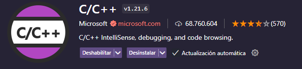

# Guía para Ejecutar Programas en C++

## 1. Requisitos Previos

### a. Descargar un Editor de Texto
Para escribir y editar código en C++, es necesario utilizar un editor de texto adecuado. Una buena opción es **Visual Studio Code**.


### b. Instalar Extensión para C++
Para facilitar la escritura y depuración de código en C++, es recomendable instalar la extensión **C/C++** en Visual Studio Code.



### c. Descargar un Compilador
Un compilador es necesario para convertir el código C++ en un programa ejecutable. Se recomienda **MSYS2**, que incluye el compilador GCC.


## 2. Instalación del Compilador

### a. Seguir la Guía de MSYS2
1. Visita la [página oficial de MSYS2](https://www.msys2.org/).
2. Descarga el archivo `exe`.
3. Instala MSYS2 siguiendo las instrucciones en pantalla.

### b. Configuración de MSYS2
1. Abre la terminal de MSYS2 y ejecuta el siguiente comando para instalar el compilador GCC:
   ```sh
   pacman -S mingw-w64-ucrt-x86_64-gcc
   ```
2. Actualiza el sistema y los paquetes:
   ```sh
   pacman -Suy
   pacman -Su
   ```
3. Instala las herramientas de desarrollo necesarias, se le pedirá cual libreria instalar, presionar `enter` para instalar todas:
   ```sh
   pacman -S --needed base-devel mingw-w64-x86_64-toolchain
   ```
4. Agrega la ruta del compilador a las variables de entorno del sistema o usuario:
   - **Ruta a agregar:** `C:\msys64\mingw64\bin`

5. Verifica que tengas g++:
    - `g++ --version`

6. Compilar y ejecutar programas:
    - Compilar programa cpp: `g++ archivo.cpp -o -librerias ejecutable`
    - Ejecutar programa: `.\ejecutable`